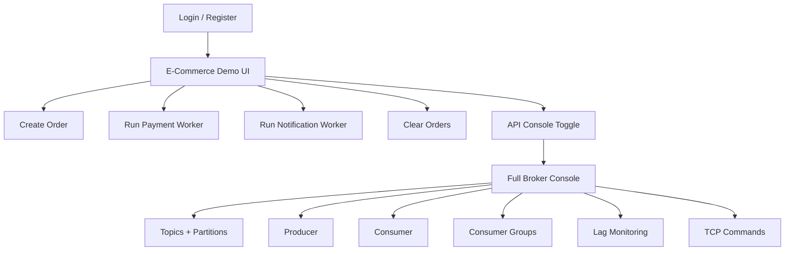
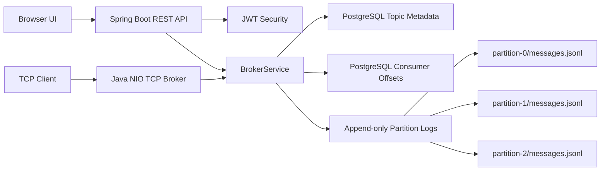
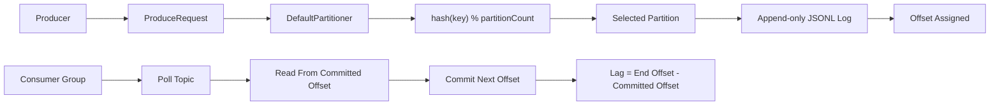
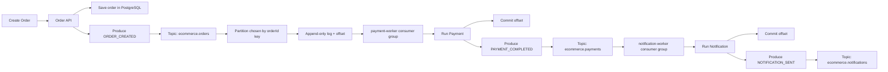
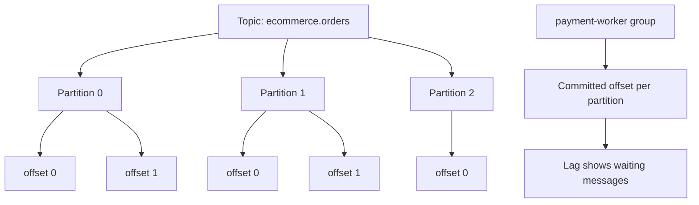

# MiniKafka

MiniKafka is a Kafka-inspired distributed event streaming platform built with Java 17 and Spring Boot. It implements the core ideas behind Kafka: topics, partitions, producers, consumers, consumer groups, offsets, consumer lag, append-only log storage, broker administration, REST APIs, and a Java NIO TCP broker.

It also includes a small e-commerce order-processing demo so the platform can be demonstrated visually from the browser.

> This project is not a full Kafka replacement. It is a learning-focused implementation of Kafka-style internals and event-driven communication.

## Tech Stack

- Java 17
- Spring Boot 3
- Spring Security + JWT
- Spring Data JPA
- PostgreSQL
- Java NIO TCP sockets
- ExecutorService
- Append-only JSONL log files
- Docker + Docker Compose
- JUnit 5, Mockito, AssertJ
- Static HTML/CSS/JavaScript demo UI

## Main Features

- JWT authentication and role-based admin access
- Topic creation, listing, deletion, and partition expansion
- Producer API for publishing messages to topics
- Consumer API for reading messages from topics and partitions
- Consumer groups with committed offsets
- Consumer lag monitoring
- Ordered append-only log storage per partition
- PostgreSQL persistence for users, topics, and consumer offsets
- Broker admin APIs for stats, config, storage, and topic details
- Java NIO TCP broker protocol
- Browser UI with:
  - Login/register screen
  - E-commerce order demo
  - API Console toggle for full broker operations
  - Clear Orders demo reset

## Visual Overview



## Architecture



## Core MiniKafka Flow



## E-Commerce Demo Flow

The demo shows how another backend system can use MiniKafka as an event broker.



In the e-commerce demo, each demo topic has 3 partitions:

```text
ecommerce.orders          -> 3 partitions
ecommerce.payments        -> 3 partitions
ecommerce.notifications   -> 3 partitions
```

Partition selection uses the message key:

```text
partition = hash(messageKey) % numberOfPartitions
```

For order events:

```text
messageKey = orderId
partition = hash(orderId) % 3
```

This keeps events with the same order ID on the same partition, preserving order for that key.

## Partition And Offset Example



## How To Run

### Option 1: Run With Docker

Use this when Docker Desktop is installed and running.

```bash
docker compose up --build
```

Then open:

```text
http://localhost:8080
```

REST API:

```text
http://localhost:8080
```

TCP broker:

```text
localhost:9092
```

### Option 2: Run Locally With PostgreSQL

Start PostgreSQL first, then run:

```bash
mvn spring-boot:run
```

Useful environment variables:

```bash
POSTGRES_HOST=localhost
POSTGRES_PORT=5432
POSTGRES_DB=minikafka
POSTGRES_USER=minikafka
POSTGRES_PASSWORD=minikafka
JWT_SECRET=replace-with-at-least-32-characters
MINIKAFKA_TCP_PORT=9092
```

### Option 3: Quick Demo Without Docker

This runs the app with the test profile and an in-memory H2 database. It is useful for interview demos when PostgreSQL or Docker is not available.

PowerShell:

```powershell
$env:SPRING_PROFILES_ACTIVE="test"
mvn spring-boot:test-run
```

Git Bash:

```bash
SPRING_PROFILES_ACTIVE=test mvn spring-boot:test-run
```

Then open:

```text
http://localhost:8080
```

Note: H2 data is temporary and resets when the app stops.

## Browser Demo

Open:

```text
http://localhost:8080
```

Demo flow:

1. Register or login.
2. Create an order.
3. Observe the order event count and lag.
4. Click `Run Payment`.
5. Observe payment topic count and payment lag.
6. Click `Run Notification`.
7. Observe notification topic count and notification lag.
8. Use `Clear Orders` to reset the e-commerce demo.
9. Toggle `API Console` to open the full broker console.

The UI intentionally lets you run workers manually. This makes asynchronous event processing easy to demonstrate step by step.

## REST Quick Start

Register the first user. The first registered user receives admin access.

```bash
curl -X POST http://localhost:8080/api/v1/auth/register \
  -H "Content-Type: application/json" \
  -d '{"username":"admin","email":"admin@example.com","password":"password123"}'
```

Set the returned JWT:

```bash
TOKEN=ey...
```

Create a topic:

```bash
curl -X POST http://localhost:8080/api/v1/topics \
  -H "Authorization: Bearer $TOKEN" \
  -H "Content-Type: application/json" \
  -d '{"name":"orders","partitions":3}'
```

Produce a message:

```bash
curl -X POST http://localhost:8080/api/v1/topics/orders/messages \
  -H "Authorization: Bearer $TOKEN" \
  -H "Content-Type: application/json" \
  -d '{"key":"order-1","value":"{\"status\":\"created\"}","headers":{"source":"checkout"}}'
```

Consume from a partition:

```bash
curl "http://localhost:8080/api/v1/topics/orders/partitions/0/messages?offset=0&maxMessages=10" \
  -H "Authorization: Bearer $TOKEN"
```

Poll as a consumer group with auto-commit:

```bash
curl -X POST http://localhost:8080/api/v1/consumer-groups/checkout/topics/orders/poll \
  -H "Authorization: Bearer $TOKEN" \
  -H "Content-Type: application/json" \
  -d '{"maxMessages":10,"autoCommit":true}'
```

Check consumer lag:

```bash
curl "http://localhost:8080/api/v1/consumer-groups/checkout/topics/orders/lag" \
  -H "Authorization: Bearer $TOKEN"
```

## API Surface

### Auth

| Method | Path | Purpose |
| --- | --- | --- |
| POST | `/api/v1/auth/register` | Register user and return JWT |
| POST | `/api/v1/auth/login` | Login and return JWT |

### Topics And Messages

| Method | Path | Purpose |
| --- | --- | --- |
| POST | `/api/v1/topics` | Create topic |
| GET | `/api/v1/topics` | List topics |
| GET | `/api/v1/topics/{topic}` | Get topic metadata |
| DELETE | `/api/v1/topics/{topic}` | Delete topic and logs |
| GET | `/api/v1/topics/{topic}/partitions` | List partitions |
| PUT | `/api/v1/topics/{topic}/partitions?target=6` | Increase partition count |
| GET | `/api/v1/topics/{topic}/offsets/end` | Get end offsets |
| POST | `/api/v1/topics/{topic}/messages` | Produce message |
| GET | `/api/v1/topics/{topic}/messages` | Consume across partitions |
| GET | `/api/v1/topics/{topic}/partitions/{partition}/messages` | Consume from one partition |
| GET | `/api/v1/topics/{topic}/partitions/{partition}/messages/{offset}` | Read one message |

### Consumer Groups

| Method | Path | Purpose |
| --- | --- | --- |
| GET | `/api/v1/consumer-groups` | List consumer groups |
| GET | `/api/v1/consumer-groups/{groupId}/offsets` | List all group offsets |
| GET | `/api/v1/consumer-groups/{groupId}/topics/{topic}/offsets` | List group offsets for topic |
| POST | `/api/v1/consumer-groups/{groupId}/topics/{topic}/offsets` | Commit next offset |
| POST | `/api/v1/consumer-groups/{groupId}/topics/{topic}/poll` | Poll as a consumer group |
| GET | `/api/v1/consumer-groups/{groupId}/topics/{topic}/lag` | View consumer lag |

### Admin

| Method | Path | Purpose |
| --- | --- | --- |
| GET | `/api/v1/admin/broker` | Broker stats |
| GET | `/api/v1/admin/storage` | Storage stats |
| GET | `/api/v1/admin/config` | Runtime config |
| GET | `/api/v1/admin/topics/{topic}/stats` | Topic stats |
| POST | `/api/v1/admin/tcp/command` | Run TCP command through REST |

### E-Commerce Demo

| Method | Path | Purpose |
| --- | --- | --- |
| POST | `/api/v1/demo/ecommerce/orders` | Create order and produce `ORDER_CREATED` event |
| GET | `/api/v1/demo/ecommerce/orders` | List demo orders |
| POST | `/api/v1/demo/ecommerce/payments/process` | Run payment worker |
| POST | `/api/v1/demo/ecommerce/notifications/process` | Run notification worker |
| POST | `/api/v1/demo/ecommerce/reset` | Clear demo orders, topics, messages, offsets, and lag |
| GET | `/api/v1/demo/ecommerce/state` | Get orders, events, and lag |

## TCP Protocol

Connect with `nc localhost 9092` or another line-oriented TCP client. Each command returns one JSON line.

```text
HELP
CREATE_TOPIC orders 3
TOPICS
PRODUCE orders order-1 checkout-created
CONSUME orders 0 0 10
POLL checkout orders 10 true
COMMIT checkout orders 0 5
OFFSETS checkout orders
STATS
```

## Storage Model

Each topic partition is stored as an append-only JSONL file:

```text
data/minikafka-logs/
  orders/
    partition-0/messages.jsonl
    partition-1/messages.jsonl
    partition-2/messages.jsonl
```

Offsets are contiguous and ordered per partition. Consumer group commits store the next offset to read.

Example:

```text
partition 0
offset 0 -> first message
offset 1 -> second message
offset 2 -> third message
```

If a consumer group commits offset `2`, the next message it should read is offset `2`.

## Key Concepts Demonstrated

### Producer

A producer writes a message to a topic.

```text
Order API -> ecommerce.orders
```

### Topic

A topic is a named stream of messages.

```text
ecommerce.orders
```

### Partition

A partition is an ordered append-only log inside a topic.

```text
ecommerce.orders/partition-0
ecommerce.orders/partition-1
ecommerce.orders/partition-2
```

### Offset

An offset is the position of a message inside a partition.

```text
offset 0
offset 1
offset 2
```

### Consumer Group

A consumer group is a named group of consumers that tracks its own offsets.

```text
payment-worker
notification-worker
checkout
```

### Lag

Lag shows how far a consumer group is behind.

```text
lag = endOffset - committedOffset
```

## Tests

Run:

```bash
mvn test
```

Compile without tests:

```bash
mvn -DskipTests compile
```

The tests cover append-only log storage, partitioning, TCP command parsing, and broker service behavior.

## GitHub Checklist

Before pushing:

```bash
mvn -DskipTests compile
```

Then:

```bash
git add .
git commit -m "Add MiniKafka event streaming platform"
git remote add origin <your-github-repo-url>
git push -u origin master
```

Do not commit real secrets. Use `.env.example` for sample environment values.

## Current Limitations

MiniKafka intentionally focuses on core Kafka concepts. It does not currently implement:

- Broker replication
- Leader election
- Distributed consensus
- Automatic consumer rebalancing
- Kafka protocol compatibility
- Production-grade retention and compaction

These are good future enhancements, but the current project is complete enough to demonstrate event streaming internals and event-driven application design.
